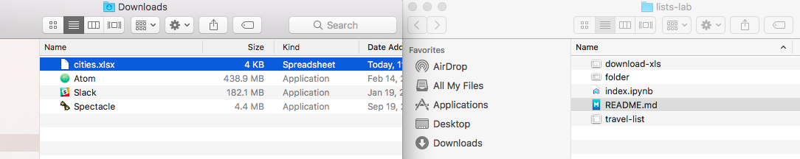
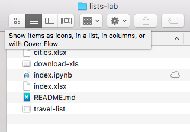

# From a spreadsheet to Python

### Introduction

Now that we know a little bit about lists and dictionaries, we can see how to take data that may currently exist in a different format, and move it into code.  This lesson is a little different in that the goal is more to show what's possible than to understand every line.  But hopefully you can see that in just a few lines of code, you can use tools in Python to work with data you have in other formats.

### Objectives

* Understand how the list data structure aligns with data in non-programming contexts
* Understand how the dictionary data structure aligns with data in non-programming contexts
* See some of the steps involved in getting data from a different format and into code

### From Google Sheet to Local File

For example, here is [our list of travel cities and countries](https://docs.google.com/spreadsheets/d/1BTJMMFH9t4p5UmHj5kiC6PGfMN6yaaaZkocx0mDqTK0/edit?usp=drive_web&ouid=111878893823071965889) in the form of a google document.


Now if we download this list in the form of an .xlsx file we can start to work with it.


So we move the downloaded `.xlsx` file from our Downloads folder to our `lists-lab` folder so that we know how to access it.



As you can see,the `cities.xlsx` file is in the folder that has this lab.  



 And you can see that same file [in the github repository](https://github.com/learn-co-curriculum/python-lists-lab).

### From Local File to Python

Now that we have this file in the folder we are working with, we can get this data into Python code in a few lines.

> ** Stay calm and bring a flashlight**: In the next gray box are four lines of code. They go over some topics we did not cover yet.  So don't worry, this by the end of this unit you will understand all of this code.  For right now, it's fine to just have a slight sense of what's going on.  


```python
import pandas
travel_df = pandas.read_excel('./cities.xlsx')
cities = travel_df.to_dict('records')
cities[0]
```


    {'Area': 59, 'City': 'Solta', 'Country': 'Croatia', 'Population': 1700}


The code above imported relied on using an outside library called `pandas`, as it's good at reading excel files.  A library is just a set of reusable functions.  The `pandas` library is available for free online.  We tell our current Jupyter notebook that we are about to use it with the line `import pandas`.  

And that gives us an object, like a dictionary, which has a method on it called `read_excel`.  Similar so how we can call `{'foo': 'bar'}.keys()`.  That's the benefit of a library, we can get methods that do not come out of the box with python.  So we use the `read_excel` data to read our excel file, by providing the name of the file, `cities.xlsx`, and the preceding `./` just indicates the the file can be found in the current folder.  Finally with the line `travel_df.to_dict('records')` we return a list of our dictionaries representing our data.  

Here is the code again, with some comments, if you are interested.


```python
# Here we use a library, which is some code not part of standard Python, to this process easier
import pandas
# If we use the `import pandas` we have access to the pandas library
travel_df = pandas.read_excel('./cities.xlsx')
# We call the pandas.read_excel method and pass through the string './cities.xlsx' as the file is called cities.xlsx.  By saying './' we are saying
# go to the current folder, lists-lab, and find the 'cities.xlsx' file there
cities = travel_df.to_dict('records')
```


```python
cities
```


    [{'Area': 59, 'City': 'Solta', 'Country': 'Croatia', 'Population': 1700},
     {'Area': 68, 'City': 'Greenville', 'Country': 'USA', 'Population': 84554},
     {'Area': 4758,
      'City': 'Buenos Aires',
      'Country': 'Argentina',
      'Population': 13591863},
     {'Area': 3750,
      'City': 'Los Cabos',
      'Country': 'Mexico',
      'Population': 287651},
     {'Area': 33,
      'City': 'Walla Walla Valley',
      'Country': 'USA',
      'Population': 32237},
     {'Area': 200, 'City': 'Marakesh', 'Country': 'Morocco', 'Population': 928850},
     {'Area': 491,
      'City': 'Albuquerque',
      'Country': 'New Mexico',
      'Population': 559277},
     {'Area': 8300,
      'City': 'Archipelago Sea',
      'Country': 'Finland',
      'Population': 60000},
     {'Area': 672,
      'City': 'Iguazu Falls',
      'Country': 'Argentina',
      'Population': 0},
     {'Area': 27, 'City': 'Salina Island', 'Country': 'Italy', 'Population': 4000},
     {'Area': 2731571, 'City': 'Toronto', 'Country': 'Canada', 'Population': 630},
     {'Area': 3194,
      'City': 'Pyeongchang',
      'Country': 'South Korea',
      'Population': 2581000}]


But look! That variable `cities` is full of cities from our spreadsheet.


And we got there in four lines of code.


```python
import pandas
file_name = './cities.xlsx'
travel_df = pandas.read_excel(file_name)
cities = travel_df.to_dict('records')
```

And now that we have data, we can operate on just like a normal list of dictionaries.

### Summary

In this section we saw how to get our data from the outside world and into Python.  The purpose isn't to understand all of this code right now, but rather to see how easily we can start working with outside data.  As we become better at Python, the usefulness of taking data and operating on it in code rather than a spreadsheet will become more apparent.  But that doesn't mean we can't get step outside of Python sandbox now.  It's not too difficult to take some data we may already have, and begin to use it with Python.  In the next section, we'll use a lab to get data from excel and work with lists.
