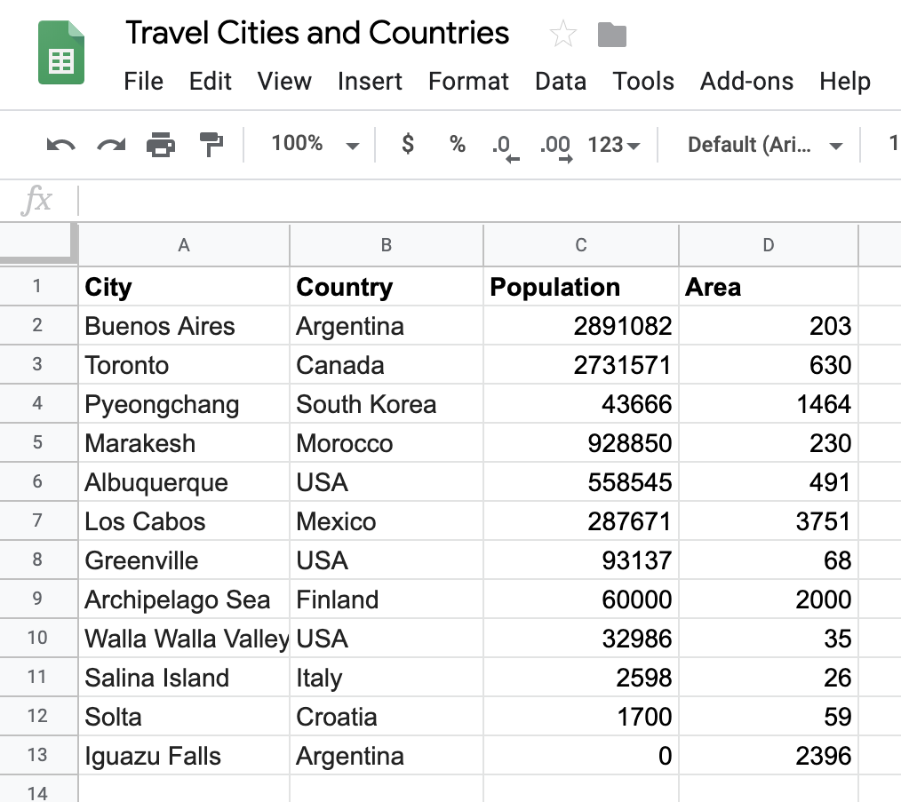
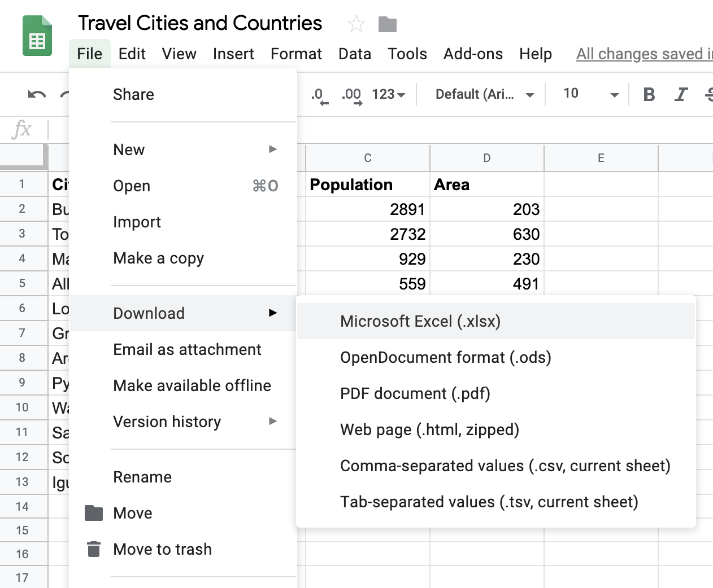

# Going further with dictionaries 

### Introduction

Now that we know a little bit about lists and dictionaries, we can take data in a different digital format, and move it into code.  In this lesson, we'll see that in just a few lines of code, we can use Python to work with data in other formats.  Then we'll learn a couple of other methods for working with dictionaries: `keys()`, `values()`, and the `dict()` constructor.

### Objectives

* Understand how the list data structure aligns with data in non-programming contexts
* Understand how the dictionary data structure aligns with data in non-programming contexts
* See some of the steps involved in getting data from a different format and into code

### From Google Sheet to Local File

For example, here is [our list of travel cities and countries](https://docs.google.com/spreadsheets/d/1BTJMMFH9t4p5UmHj5kiC6PGfMN6yaaaZkocx0mDqTK0/edit?usp=drive_web&ouid=111878893823071965889) in the form of a google document.  If you click on the link, you will see our spreadsheet.



Now if we download this spreadsheet in the form of an .xlsx file we can start to work with it.



We placed that file into this lesson, and you can see it [here](https://github.com/learn-co-curriculum/python-lists-lab), where the contents of this lesson are also located.

### From Local File to Python 

Now that we have this file in the folder we are working with, we can get this data into Python code in a few lines.

> ** Deep breath, soft eyes**: In the gray box below are four lines of code. They go over some topics we did not cover yet.  So don't worry, if you don't follow everything right now.  By the end of this unit, you will understand all of the code.  For right now, it's fine to just have a slight sense of what's going on.  


```python
import pandas
travel_df = pandas.read_excel('./cities.xlsx')
cities = travel_df.to_dict('records')
cities[0]
```


    {'Area': 59, 'City': 'Solta', 'Country': 'Croatia', 'Population': 1700}


> Press shift+enter to run the code.

The code above relies on using an outside library called `pandas`, as it's good at reading excel files.  A library is just a set of reusable functions.  The `pandas` library is available for free online.  We tell our current Jupyter notebook that we are about to use it with the line `import pandas`.  

And that gives us an object, like a dictionary, which has a method on it called `read_excel`.  Similar so how we can call `{'foo': 'bar'}.keys()`.  That's the benefit of a library, we can get methods that do not come out of the box with Python.  So we use the `read_excel` data to read our excel file, by providing the name of the file, `cities.xlsx`, and the preceding `./` just indicates that the file is found in the current folder.  Finally with the line `travel_df.to_dict('records')` we return a list of our dictionaries representing our data.  You can see that when we access the first element of this list, we it returns our first dictionary.  

Here is the code again, with some comments, if you are interested.


```python
# Here we use a library, which is some code not part of standard Python, to this process easier 
import pandas
# If we use the `import pandas` we have access to the pandas library 
travel_df = pandas.read_excel('./cities.xlsx')
# We call the pandas.read_excel method and pass through the string './cities.xlsx' as the file is called cities.xlsx.  By saying './' we are saying 
# go to the current folder, lists-lab, and find the 'cities.xlsx' file there
cities = travel_df.to_dict('records')
```


```python
cities
```


    [{'Area': 59, 'City': 'Solta', 'Country': 'Croatia', 'Population': 1700},
     {'Area': 68, 'City': 'Greenville', 'Country': 'USA', 'Population': 84554},
     {'Area': 4758,
      'City': 'Buenos Aires',
      'Country': 'Argentina',
      'Population': 13591863},
     {'Area': 3750,
      'City': 'Los Cabos',
      'Country': 'Mexico',
      'Population': 287651},
     {'Area': 33,
      'City': 'Walla Walla Valley',
      'Country': 'USA',
      'Population': 32237},
     {'Area': 200, 'City': 'Marakesh', 'Country': 'Morocco', 'Population': 928850},
     {'Area': 491,
      'City': 'Albuquerque',
      'Country': 'New Mexico',
      'Population': 559277},
     {'Area': 8300,
      'City': 'Archipelago Sea',
      'Country': 'Finland',
      'Population': 60000},
     {'Area': 672,
      'City': 'Iguazu Falls',
      'Country': 'Argentina',
      'Population': 0},
     {'Area': 27, 'City': 'Salina Island', 'Country': 'Italy', 'Population': 4000},
     {'Area': 2731571, 'City': 'Toronto', 'Country': 'Canada', 'Population': 630},
     {'Area': 3194,
      'City': 'Pyeongchang',
      'Country': 'South Korea',
      'Population': 2581000}]


Look at that. Our variable `cities` is full of cities from our spreadsheet.


And we got there in four lines of code.


```python
import pandas
file_name = './cities.xlsx'
travel_df = pandas.read_excel(file_name)
cities = travel_df.to_dict('records')
```

And now that we have data, we can operate on just like a normal list of dictionaries.

### Working with the keys and values functions

Now that we have the data in Python, we can use a couple of other of functions to quickly explore our data.  For example, let's say that we want to remind ourselves of all of the attributes associated with a single city.  If we just look at the first element we see both the keys and values.


```python
cities[0]
```


    {'Area': 59, 'City': 'Solta', 'Country': 'Croatia', 'Population': 1700}


But, we really only need to see the keys.


```python
cities[0].keys()
```


    dict_keys(['City', 'Country', 'Population', 'Area'])


Note that the `keys()` function returns a `dict_keys` object.  It's a little tricky to work with that type of object, so let's coerce it into a list.


```python
list(cities[0].keys())
```


    ['City', 'Country', 'Population', 'Area']


Much better.

If we would like to also see our values of a dictionary in a list, we can do something similar with the `.values()` function for a dictionary.


```python
cities[0].values()
```


    dict_values(['Solta', 'Croatia', 1700, 59])


```python
list(cities[0].values())
```


    ['Solta', 'Croatia', 1700, 59]


Once again, we call the method, and then coerce it into a list, by using the `list` function.

### Creating Dictionaries

So far, we have seen one way of creating dictionaries: 


```python
philadelphia = {'City': 'Philadelphia'}
```

But there is another way!


```python
pittsburgh = dict(city='Pittsburgh')
pittsburgh
```


    {'city': 'Pittsburgh'}


As you can see, by using the keyword `dict`, we can pass through the name of the key followed by the equal sign.  Notice that the key name is provided as a string, but Python still knows how to handle it.  

Let's do one more.


```python
dict(city="Las Vegas", state="Nevada")
```


    {'city': 'Las Vegas', 'state': 'Nevada'}


### Summary

In this section we saw how to get our data from the outside world and into Python.  As we become better at Python, the usefulness of taking data and operating on it in code rather than a spreadsheet will become more apparent.  But that doesn't mean we can't get step outside of Python sandbox now.  It's not too difficult to take some data we may already have, and begin to use it with Python.

Afterwards, we saw a few more methods for operating on dictionaries in Python.  Namely, we saw how to use the `keys()` function to retrieve the keys of a dictionary, and the `values()` function to create values.  Finally, we saw how to use the `dict()` constructor to create a new dictionary.
